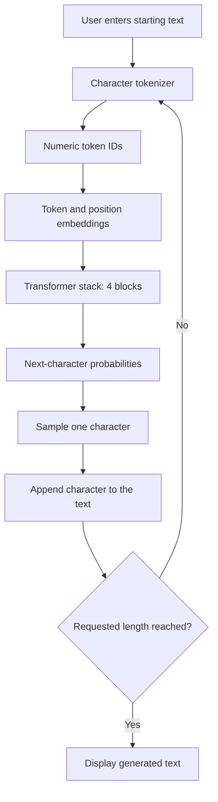

# Mini Transformer from Scratch

A character-level, decoder-only Transformer built from scratch using PyTorch. The model learns patterns from Shakespeare’s writing and generates new text one character at a time.

This project was created to understand what happens inside a Transformer—not simply how to use a pretrained model.

> This implementation does not use `nn.Transformer`, `nn.MultiheadAttention`, or a pretrained language model.

**Current status:** Trained, tested, and running locally through a Gradio application. Public deployment is planned.

## Why I Built This

Modern language models can feel like black boxes. I wanted to understand how text moves through a Transformer, how attention works, how the model learns from mistakes, and how generated text is produced.

To make that process visible, I built each major component manually and documented it step by step in a Jupyter notebook.

## The Idea in Simple Words

Imagine reading:

> To be, or not to...

After seeing enough Shakespeare, you may predict that the next word is “be.”

This model learns in a similar way. However, instead of predicting complete words, it predicts one character at a time:

```text
R → O → M → E → O → :
```

Each predicted character is added to the existing text. The updated text is then used to predict the following character.

## Architecture



### Architecture Explained

| Stage             | Plain-English Explanation                                      | Technical Role                       |
| ----------------- | -------------------------------------------------------------- | ------------------------------------ |
| Starting text     | The user provides the beginning of the text.                   | Input prompt                         |
| Tokenizer         | Each character is converted into a number.                     | Character-level encoding             |
| Embeddings        | Each character receives a learned representation and position. | Token and positional embeddings      |
| Transformer stack | The model studies relationships between earlier characters.    | Four decoder-only Transformer blocks |
| Probabilities     | The model scores every possible next character.                | Vocabulary logits and softmax        |
| Sampling          | One character is selected from the probability distribution.   | Temperature-based sampling           |
| Generation loop   | The new character is added, and prediction repeats.            | Autoregressive generation            |

## How the Model Works

### 1. Text Becomes Tokens

Computers work with numbers rather than text. The tokenizer creates a vocabulary containing every unique character in the dataset and assigns each one a numeric ID.

```text
Text:   hello
Tokens: [h_id, e_id, l_id, l_id, o_id]
```

The Tiny Shakespeare dataset produces a vocabulary of 65 unique characters.

### 2. Tokens Become Embeddings

A token ID only identifies a character. It does not describe how that character is used.

The model converts every ID into a learned vector called a **token embedding**. It also adds a **positional embedding** so the model knows where the character appears.

```text
Token embedding    → What is the character?
Position embedding → Where does it appear?
```

### 3. Self-Attention Finds Relevant Context

Self-attention allows every character to examine earlier characters and decide which ones are useful.

Each token creates three vectors:

* **Query:** What information am I looking for?
* **Key:** What information do I contain?
* **Value:** What information should I share?

The attention calculation is:

$$
\text{Attention}(Q,K,V)
=
\text{softmax}
\left(
\frac{QK^T}{\sqrt{d_k}} + M
\right)V
$$

The scores are divided by \(\sqrt{d_k}\) to keep them stable. The causal mask \(M\) prevents the model from seeing future characters during training.

### 4. Multiple Heads Learn Different Patterns

The model uses four attention heads. Each head can learn a different type of relationship, such as:

* Nearby character patterns
* Word structure
* Punctuation
* Dialogue formatting

The results from all heads are combined into one representation.

### 5. Transformer Blocks Refine the Information

The model contains four Transformer blocks.

Each block follows this process:

```text
Input
→ Layer Normalization
→ Multi-Head Causal Self-Attention
→ Residual Connection
→ Layer Normalization
→ Feed-Forward Network
→ Residual Connection
→ Output
```

Attention shares information across character positions. The feed-forward network processes that information. Normalization and residual connections help keep training stable.

### 6. The Model Learns from Mistakes

The model is trained to predict the next character at every position.

```text
Input:  hell
Target: ello
```

Cross-entropy loss measures how incorrect the predictions are. PyTorch calculates gradients and updates the model’s parameters to reduce that loss.

### 7. The Model Generates Text

If the user enters:

```text
ROMEO:
```

the model:

1. Converts the prompt into tokens.
2. Uses up to 64 characters as context.
3. Calculates probabilities for the next character.
4. Samples one character.
5. Adds it to the text.
6. Repeats until it reaches the requested length.

This is **text completion**, not question answering.

## Model Configuration

| Setting            |                    Value |
| ------------------ | -----------------------: |
| Model type         | Decoder-only Transformer |
| Tokenization       |          Character-level |
| Vocabulary size    |                       65 |
| Context length     |            64 characters |
| Embedding size     |                      128 |
| Attention heads    |                        4 |
| Transformer blocks |                        4 |
| Parameters         |                  816,705 |
| Training data      |         Tiny Shakespeare |

## Transformer vs. LSTM

An LSTM baseline was trained on the same dataset with similar model size and training conditions.

| Model       | Parameters | Train Loss | Validation Loss | Perplexity | Training Time |
| ----------- | ---------: | ---------: | --------------: | ---------: | ------------: |
| Transformer |    816,705 |      1.552 |           1.713 |       5.54 |      0.93 min |
| LSTM        |    743,329 |      1.574 |           1.724 |       5.61 |      0.68 min |

The Transformer achieved slightly better validation loss and perplexity. The LSTM used fewer parameters and trained faster.

The difference is modest, so experiments using multiple random seeds would be needed before claiming that one architecture is definitively better.

## Training Progress

The training and validation curves show how the model improved and help identify possible overfitting.


## Attention Visualization

The heatmap shows which earlier characters one attention head focused on.

The empty upper-right area confirms that causal masking prevented the model from viewing future characters.


## Local Application

The Gradio interface allows users to:

* Enter their own starting text
* Select the number of characters to generate
* Adjust the generation temperature
* View the generated continuation

Temperature affects randomness:

* Lower values produce safer, more repetitive text.
* Higher values produce more varied, less predictable text.

The application currently runs locally and has not yet been publicly deployed.

## Project Structure

```text
mini-transformer/
├── app.py
├── README.md
├── requirements.txt
├── assets/
│   ├── attention_head.png
│   └── training_loss.png
├── checkpoints/
│   └── mini_transformer.pt
├── data/
│   └── input.txt
├── notebooks/
│   └── 01_text_to_tokens.ipynb
├── src/
│   ├── __init__.py
│   └── model.py
└── tests/
    └── test_model.py
```

## Installation

Create the Python environment:

```bash
conda create -n mini-transformer python=3.11 -y
conda activate mini-transformer
```

Install the dependencies:

```bash
python -m pip install -r requirements.txt
```

## Run the Application

```bash
python app.py
```

Open the local URL:

```text
http://127.0.0.1:7860
```

## Run the Tests

```bash
python -m pytest -v
```

The automated tests verify:

* Model output dimensions
* Causal masking
* Generated sequence length

## Dataset

The model was trained using the [Tiny Shakespeare dataset](https://raw.githubusercontent.com/karpathy/char-rnn/master/data/tinyshakespeare/input.txt).

The dataset contains Shakespeare-style plays and dialogue commonly used for small character-level language-modeling experiments.

## Limitations

This is an educational language model, not a replacement for a modern large language model.

* It predicts characters rather than subword tokens.
* It can only use 64 previous characters.
* It imitates Shakespeare-style patterns without understanding language like ChatGPT.
* It may generate invented words or incomplete ideas.
* Results vary because characters are sampled probabilistically.

## What I Learned

* How text becomes tokens and embeddings
* How Queries, Keys, and Values create self-attention
* Why attention scores are scaled
* How causal masking prevents future information leakage
* How multiple attention heads capture different patterns
* How feed-forward networks transform token representations
* How normalization and residual connections stabilize training
* How to compare a Transformer with an LSTM baseline
* How to evaluate, visualize, test, save, and run a language model locally

## Future Improvements

* Use subword tokenization
* Increase the context window
* Train a larger model for longer
* Repeat experiments with multiple random seeds
* Add top-k and top-p sampling
* Add automated training scripts
