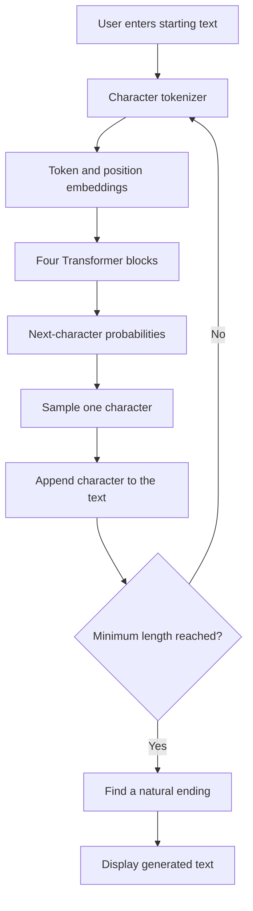

# Mini Transformer from Scratch

This project began with a simple question: what happens inside a Transformer between receiving text and predicting what comes next?

To explore that process, I built a small character-level Transformer in PyTorch and trained it on Tiny Shakespeare. The model reads characters, uses self-attention to connect them with earlier context, and predicts the next character. Repeating this process produces new Shakespeare-style text.

The project was built one component at a time, from tokenization and embeddings to attention, training, evaluation, testing, visualization, and deployment.

## Live Demo

Try the trained model here:

[Open the Mini Transformer Text Generator](https://mini-transformer-from-scratch.streamlit.app)

Enter some starting text, choose a minimum generation length, and adjust the creativity level. The model may generate a few additional characters so the output ends naturally.

## The Idea in Simple Words

Consider this unfinished sentence:

> To be, or not to...

After seeing enough Shakespeare, someone may predict that the next word is “be.”

This model learns a similar pattern, but it predicts one character at a time:

```text
R → O → M → E → O → :
```

Each predicted character is added to the text and becomes part of the context for the next prediction.

This is text completion, not question answering. The model imitates patterns from its training data but does not understand language like a person.

## Architecture



Each Transformer block contains:

```text
Input
→ Layer Normalization
→ Multi-Head Causal Self-Attention
→ Residual Connection
→ Layer Normalization
→ Feed-Forward Network
→ Residual Connection
→ Output
```

## How the Model Works

### 1. Text Becomes Tokens

Computers work with numbers rather than text. The tokenizer finds every unique character in the dataset and assigns it a numeric ID.

```text
Text:   hello
Tokens: [h_id, e_id, l_id, l_id, o_id]
```

Tiny Shakespeare produces a vocabulary of 65 unique characters.

### 2. Tokens Become Embeddings

A token ID identifies a character but does not describe how that character is being used.

The model converts each token into a learned vector called a token embedding. It also adds a positional embedding so the model knows where the character appears.

```text
Token embedding    → What is the character?
Position embedding → Where does it appear?
```

### 3. Self-Attention Finds Relevant Context

Self-attention allows every character to examine earlier characters and decide which ones are useful for the next prediction.

Each token creates three vectors:

- **Query:** What information am I looking for?
- **Key:** What information do I contain?
- **Value:** What information should I share?

The attention calculation is:

```text
Attention(Q, K, V) = softmax((Q × Kᵀ) / √dₖ + mask) × V
```

The scores are divided by the square root of the key dimension to keep their values stable.

A causal mask prevents the model from viewing future characters during training. This ensures that each prediction uses only the characters that came before it.

### 4. Multiple Heads Learn Different Patterns

The model uses four attention heads. Each head processes the same sequence independently and can learn a different relationship, such as:

- Nearby character patterns
- Word structure
- Punctuation
- Dialogue formatting

The outputs from all four heads are joined into one representation.

### 5. Transformer Blocks Refine the Information

The model contains four Transformer blocks.

Attention shares information across character positions. The feed-forward network then processes the updated representation.

Layer normalization and residual connections help information and gradients move reliably through the network.

### 6. The Model Learns from Mistakes

Training examples are created by shifting the text one character forward:

```text
Input:  hell
Target: ello
```

At every position, the model predicts the character that should come next.

Cross-entropy loss measures the difference between the prediction and the correct target. PyTorch calculates gradients and updates the model’s parameters to reduce this loss.

### 7. The Model Generates Text

During generation, the model:

1. Receives starting text.
2. Uses up to 64 characters as context.
3. predicts probabilities for the next character.
4. Samples one character.
5. Adds the character to the text.
6. Repeats the process.

The application generates slightly beyond the selected minimum length and stops at the next `.`, `!`, or `?`. This prevents the displayed result from ending in the middle of a word or sentence when possible.

## Implementation

The Transformer is implemented using basic PyTorch components. It does not use `nn.Transformer`, `nn.MultiheadAttention`, or a pretrained language model.

PyTorch handles:

- Tensor operations
- Automatic gradient calculation
- Basic neural-network layers
- Optimization
- Model saving and loading

The implementation includes:

- Character-level tokenization
- Token and positional embeddings
- Query, Key, and Value projections
- Scaled dot-product attention
- Causal masking
- Multi-head attention
- Feed-forward networks
- Layer normalization
- Residual connections
- Dropout
- Autoregressive text generation

## Model Configuration

| Setting | Value |
|---|---:|
| Model type | Decoder-only Transformer |
| Tokenization | Character-level |
| Vocabulary size | 65 |
| Context length | 64 characters |
| Embedding size | 128 |
| Attention heads | 4 |
| Transformer blocks | 4 |
| Parameters | 816,705 |
| Training data | Tiny Shakespeare |

## Transformer vs. LSTM

An LSTM was trained on the same dataset with a similar model size and training setup. It provides a baseline for comparison.

| Model | Parameters | Train Loss | Validation Loss | Perplexity | Training Time |
|---|---:|---:|---:|---:|---:|
| Transformer | 816,705 | 1.552 | 1.713 | 5.54 | 0.93 min |
| LSTM | 743,329 | 1.574 | 1.724 | 5.61 | 0.68 min |

The Transformer produced slightly lower validation loss and perplexity. The LSTM used fewer parameters and completed training faster.

The difference is modest. Multiple experiments with different random seeds would be needed before making a strong performance claim.

Training time was recorded during a local run using Apple Silicon and PyTorch MPS. Results may vary across devices.

## Training Progress

The training and validation loss curves show how the model improved and help reveal possible overfitting.


## Attention Visualization

The heatmap shows which earlier characters one attention head focused on.

The empty upper-right section shows that causal masking prevented the model from viewing future positions.


## Interactive Applications

The project includes two interfaces.

### Streamlit Deployment

The public Streamlit application allows users to:

- Enter starting text
- Select a minimum generation length
- Adjust the creativity level
- View the generated continuation

Run it locally with:

```bash
python -m streamlit run streamlit_app.py
```

Then open:

```text
http://localhost:8501
```

### Gradio Application

A Gradio version is also included for local use:

```bash
python app.py
```

Then open:

```text
http://127.0.0.1:7860
```

### Creativity Setting

The creativity slider controls the generation temperature:

- Lower values produce safer and more repetitive text.
- Higher values produce more varied and unpredictable text.

## Project Structure

```text
mini-transformer/
├── app.py
├── streamlit_app.py
├── README.md
├── requirements.txt
├── assets/
│   ├── attention_head.png
│   └── training_loss.png
├── checkpoints/
│   └── mini_transformer.pt
├── data/
│   └── input.txt
├── notebooks/
│   └── 01_text_to_tokens.ipynb
├── src/
│   ├── __init__.py
│   └── model.py
└── tests/
    └── test_model.py
```

## Installation

Clone the repository:

```bash
git clone https://github.com/Swetha-Jalluri/mini-transformer-from-scratch.git
cd mini-transformer-from-scratch
```

Create and activate the Conda environment:

```bash
conda create -n mini-transformer python=3.11 -y
conda activate mini-transformer
```

Install the dependencies:

```bash
python -m pip install -r requirements.txt
```

## Run the Tests

```bash
python -m pytest -v
```

The automated tests verify:

- Model output dimensions
- Causal masking
- Generated sequence length

The current test suite contains three tests.

## Learning Notebook

The notebook documents the project from tokenization through the complete Transformer:

```text
notebooks/01_text_to_tokens.ipynb
```

Open it in VS Code and select the `mini-transformer` Python kernel to run the cells.

## Dataset

The model was trained using the [Tiny Shakespeare dataset](https://raw.githubusercontent.com/karpathy/char-rnn/master/data/tinyshakespeare/input.txt).

The dataset contains plays and dialogue commonly used for character-level language-modeling experiments.

## Limitations

This project intentionally uses a small architecture so its components can be trained, inspected, and understood locally.

- Character-level tokens are less efficient than modern subword tokens.
- The model can use only 64 previous characters.
- It learns writing patterns without human-like language understanding.
- It may generate invented words or incomplete ideas.
- Generated results vary because characters are sampled probabilistically.
- Natural-ending detection is simple punctuation-based post-processing.
- The LSTM comparison represents one training run.

## What I Learned

- How text is converted into tokens and embeddings
- How decoder-only Transformers process and generate text
- How Queries, Keys, and Values create self-attention
- Why attention scores are scaled
- How causal masking prevents future information from leaking
- How residual connections and normalization support training
- How to evaluate a language model against an LSTM baseline
- How to visualize attention and training progress
- How to test, save, load, and deploy a trained model

## Future Improvements

- Use subword tokenization
- Increase the context window
- Train a larger model for longer
- Repeat experiments using multiple random seeds
- Add top-k and top-p sampling
- Add more unit tests
- Add a reproducible command-line training script