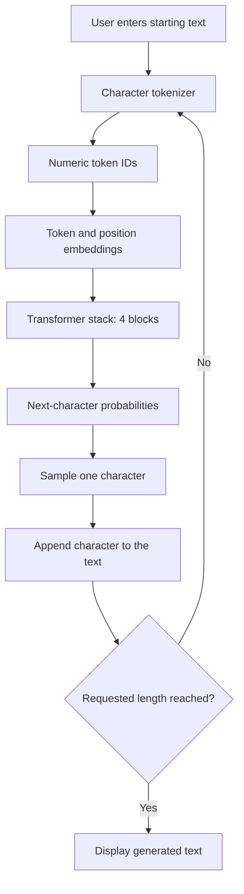
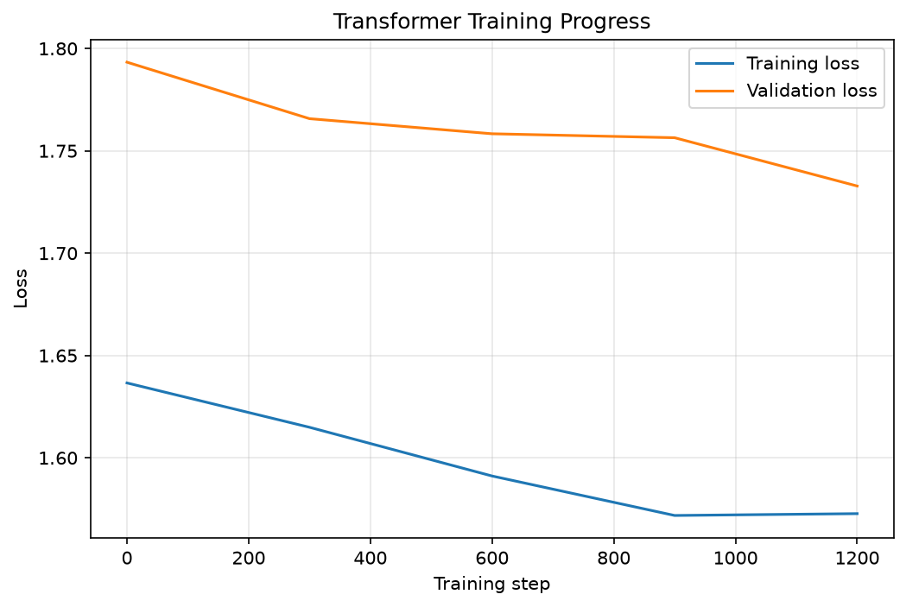
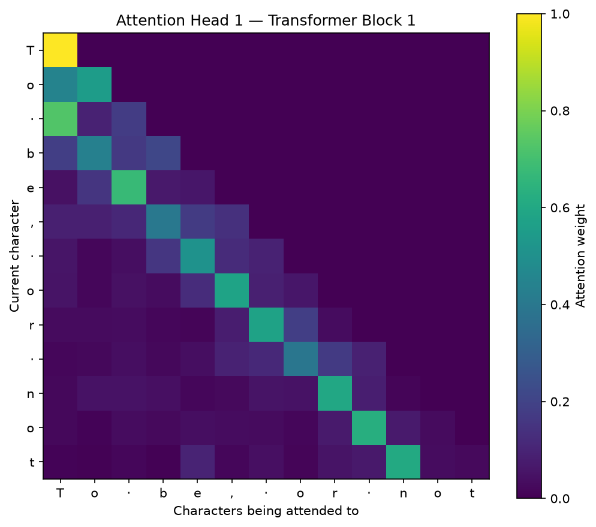

# Mini Transformer from Scratch

This project began with a simple question: what happens inside a Transformer between receiving a piece of text and predicting what comes next?

To explore that process, I built a character-level Transformer in PyTorch and trained it on Tiny Shakespeare. The model reads a sequence of characters, identifies useful relationships through self-attention, and predicts the next character. By repeating this process, it generates new Shakespeare-style text.

The project was developed one component at a time—from tokenization and embeddings to causal attention, Transformer blocks, training, evaluation, visualization, testing, and a local Gradio application.

## The Idea in Simple Words

Consider the unfinished sentence:

> To be, or not to...

After reading enough Shakespeare, someone may predict that the next word is “be.”

This model learns a similar pattern, but it predicts individual characters:

```text
R → O → M → E → O → :
```

Each prediction is added to the text and used as context for the following prediction.

## Architecture



## How the Model Works

### 1. Text Becomes Tokens

Computers work with numbers rather than text. The tokenizer finds every unique character in the dataset and assigns each one a numeric ID.

```text
Text:   hello
Tokens: [h_id, e_id, l_id, l_id, o_id]
```

The Tiny Shakespeare dataset creates a vocabulary of 65 unique characters.

### 2. Tokens Become Embeddings

A token ID identifies a character, but it does not describe how that character is being used.

The model converts each token into a learned vector called a **token embedding**. It also adds a **positional embedding** to represent where the character appears in the sequence.

```text
Token embedding    → What is the character?
Position embedding → Where does it appear?
```

### 3. Self-Attention Finds Relevant Context

Self-attention allows each character to examine earlier characters and determine which ones are useful for the next prediction.

Every token creates three vectors:

* **Query:** What information am I looking for?
* **Key:** What information do I contain?
* **Value:** What information should I share?

The attention calculation is:

```math
\operatorname{Attention}(Q,K,V)
=
\operatorname{softmax}\left(
\frac{QK^\top}{\sqrt{d_k}} + M
\right)V
```

The scores are divided by the square root of the key dimension to keep their values stable. The causal mask `M` prevents the model from viewing future characters during training.

### 4. Multiple Heads Learn Different Patterns

The model uses four attention heads. Each head processes the same sequence independently and can learn a different type of relationship, such as:

* Nearby character patterns
* Word structure
* Punctuation
* Dialogue formatting

The outputs from all four heads are joined into one representation.

### 5. Transformer Blocks Refine the Information

The model contains four Transformer blocks. Each block follows this structure:

```text
Input
→ Layer Normalization
→ Multi-Head Causal Self-Attention
→ Residual Connection
→ Layer Normalization
→ Feed-Forward Network
→ Residual Connection
→ Output
```

Attention shares information across character positions. The feed-forward network processes the resulting representation. Normalization and residual connections help information and gradients move through the network reliably.

### 6. The Model Learns from Mistakes

The training targets are created by shifting the input sequence one character forward.

```text
Input:  hell
Target: ello
```

At every position, the model predicts the character that should come next.

Cross-entropy loss measures the difference between the predictions and correct targets. PyTorch calculates gradients and updates the model’s parameters to reduce that loss.

### 7. The Model Generates Text

During generation, the model:

1. Receives starting text from the user.
2. Uses up to 64 characters as context.
3. Calculates probabilities for the next character.
4. Samples one character.
5. Adds it to the text and repeats.

This model performs **text completion**, not question answering.

## Implementation

The attention mechanism and Transformer architecture are implemented directly using basic PyTorch components rather than `nn.Transformer` or `nn.MultiheadAttention`.

PyTorch is used for:

* Tensor operations
* Automatic gradient calculation
* Basic neural-network layers
* Optimization and model saving

The main implementation includes:

* Character-level tokenizer
* Token and positional embeddings
* Query, Key, and Value projections
* Scaled dot-product attention
* Causal masking
* Multi-head attention
* Feed-forward networks
* Layer normalization
* Residual connections
* Dropout
* Autoregressive text generation

## Model Configuration

| Setting            |                    Value |
| ------------------ | -----------------------: |
| Model type         | Decoder-only Transformer |
| Tokenization       |          Character-level |
| Vocabulary size    |                       65 |
| Context length     |            64 characters |
| Embedding size     |                      128 |
| Attention heads    |                        4 |
| Transformer blocks |                        4 |
| Parameters         |                  816,705 |
| Training data      |         Tiny Shakespeare |

## Transformer vs. LSTM

To provide a baseline, an LSTM was trained using the same dataset and similar training conditions.

| Model       | Parameters | Train Loss | Validation Loss | Perplexity | Training Time |
| ----------- | ---------: | ---------: | --------------: | ---------: | ------------: |
| Transformer |    816,705 |      1.552 |           1.713 |       5.54 |      0.93 min |
| LSTM        |    743,329 |      1.574 |           1.724 |       5.61 |      0.68 min |

The Transformer produced slightly lower validation loss and perplexity. The LSTM used fewer parameters and completed training faster.

The difference is modest. Repeating the experiment with multiple random seeds would be necessary before making a definitive performance claim.

Training times were recorded during a local run using Apple Silicon with PyTorch MPS and may vary across devices.

## Training Progress

The training and validation loss curves show how the model improved during training and help reveal possible overfitting.



## Attention Visualization

This heatmap shows which earlier characters one attention head focused on.

The empty upper-right area confirms that causal masking prevented the model from viewing future positions.



## Local Application

A Gradio interface connects the saved model to a simple local application.

Users can:

* Enter their own starting text
* Select the number of characters to generate
* Adjust the generation temperature
* View the generated continuation

Temperature controls the randomness of generation:

* Lower values produce safer, more repetitive text.
* Higher values produce more varied, less predictable text.

The application currently runs locally and has not yet been publicly deployed.

## Project Structure

```text
mini-transformer/
├── app.py
├── README.md
├── requirements.txt
├── assets/
│   ├── attention_head.png
│   └── training_loss.png
├── checkpoints/
│   └── mini_transformer.pt
├── data/
│   └── input.txt
├── notebooks/
│   └── 01_text_to_tokens.ipynb
├── src/
│   ├── __init__.py
│   └── model.py
└── tests/
    └── test_model.py
```

## Installation

Create and activate the Conda environment:

```bash
conda create -n mini-transformer python=3.11 -y
conda activate mini-transformer
```

Install the dependencies:

```bash
python -m pip install -r requirements.txt
```

## Run the Application

```bash
python app.py
```

Open the local URL:

```text
http://127.0.0.1:7860
```

## Run the Tests

```bash
python -m pytest -v
```

The automated tests verify:

* Model output dimensions
* Causal masking
* Generated sequence length

## Dataset

The model was trained using the [Tiny Shakespeare dataset](https://raw.githubusercontent.com/karpathy/char-rnn/master/data/tinyshakespeare/input.txt).

The dataset contains Shakespeare-style plays and dialogue commonly used for character-level language-modeling experiments.

## Limitations

The project intentionally uses a small architecture so its components can be trained, inspected, and understood locally.

* Character-level tokens are less efficient than modern subword tokens.
* The model can use only 64 previous characters.
* It learns writing patterns without human-like language understanding.
* It may generate invented words or incomplete ideas.
* Generated results vary because characters are sampled probabilistically.
* The comparison represents one training run rather than repeated experiments.

## What I Learned

* How a decoder-only Transformer processes and generates text
* How causal self-attention works through Queries, Keys, and Values
* How normalization, residual connections, and masking support stable training
* How to evaluate a language model and compare it with an LSTM baseline
* How to test, visualize, save, and run a trained model locally

## Future Improvements

* Use subword tokenization
* Increase the context window
* Train a larger model for longer
* Repeat experiments using multiple random seeds
* Add top-k and top-p sampling
* Add a reproducible command-line training script
